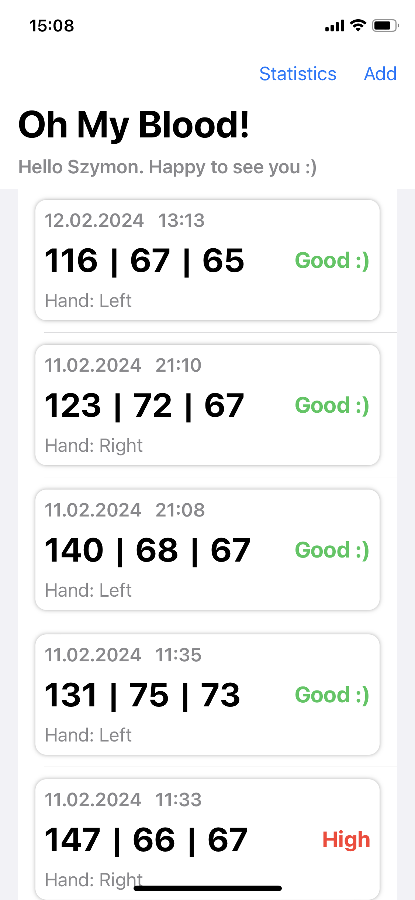
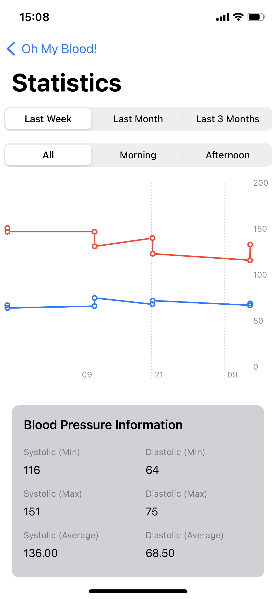
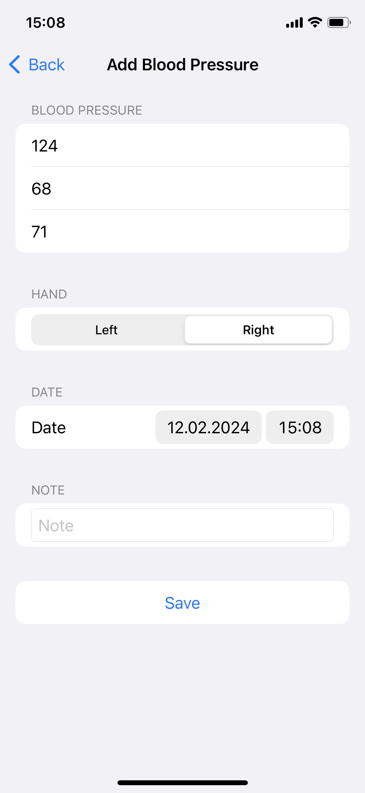

# Blood Pressure Monitor App

Blood Pressure Monitor is a simple iOS app written in Swift, designed for personal use to track and monitor blood pressure readings. With this app, users can conveniently record their systolic and diastolic blood pressure values, heart rate, hand preference, add notes, and view statistical data using interactive charts.

## Features

- Record blood pressure readings with systolic and diastolic values.
- Log heart rate measurements.
- Specify the hand used for measurement (Left/Right).
- Add notes to each blood pressure entry for additional context.
- View statistical data and trends over different periods.
- Simple and intuitive user interface.

## Screenshots

    <figure style="margin-right: 20px;">
        
        <figcaption style="text-align: center; margin-top: 10px;">Home Screen</figcaption>
    </figure>
    <figure style="margin-right: 20px;">
        
        <figcaption style="text-align: center; margin-top: 10px;">Statistics Screen</figcaption>
    </figure>
    <figure>
        
        <figcaption style="text-align: center; margin-top: 10px;">New Record Screen</figcaption>
    </figure>

## Usage

1. **Record a new reading**: Tap the "Add" button to record a new blood pressure reading. Fill in the required information such as systolic and diastolic values, heart rate, hand preference, and optional notes. Then, tap "Save" to store the reading.

2. **View statistics**: Navigate to the "Statistics" tab to view statistical data and trends. Use the segmented controls to select different periods and filter readings by time of day.

3. **Track trends**: Use the interactive line chart to track trends and patterns in your blood pressure readings over time.

## Requirements

- iOS 16.0+
- Xcode 15.0+
- Swift 5.0+

## Installation

1. Clone or download the repository.
2. Open the project in Xcode.
3. Build and run the app on a simulator or physical device.

## License

This project is licensed under the [MIT License](LICENSE).
